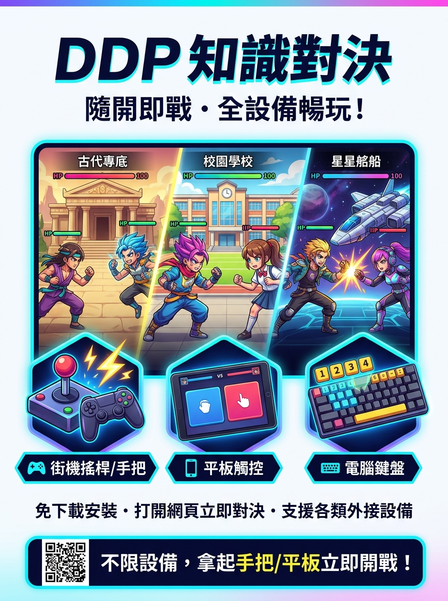
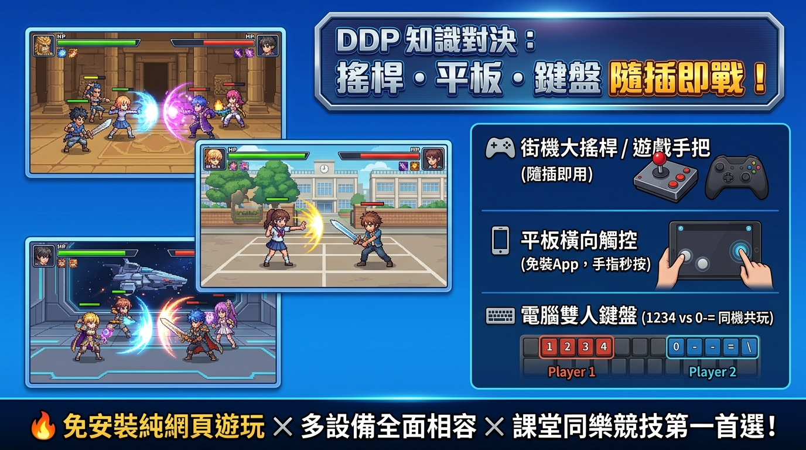
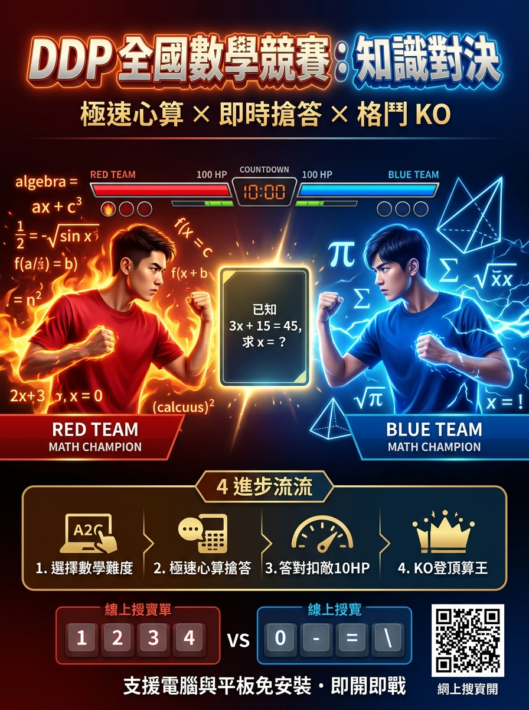
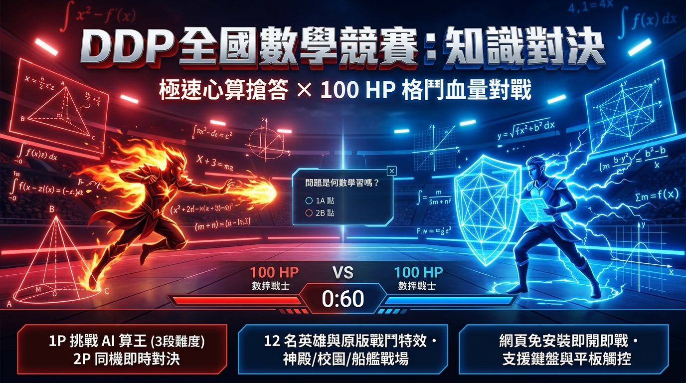

# ⚔️ DDP 知識對決 (DD2P Quiz Web)

> **腦力全開！即時搶答 × 格鬥 KO —— 誰才是真正的答題王者？**

《DDP 知識對決》是一套以經典知識搶答對戰重新打造的現代跨平台網頁遊戲。結合**「學科知識搶答」**與**「格鬥血量 KO 機制」**，以純前端靜態技術（HTML5、CSS3、JavaScript ES Modules）打造。支援**街機搖桿、平板觸控、電腦鍵盤**等多元輸入，隨開即玩、零延遲搶答，是課堂互動、學科競賽、同樂競技的最佳選擇！

---

## 🎮 線上直接遊玩 (Live Demo)

* 🔗 **遊戲正式網址**：**[https://coolokey.github.io/dd2p-quiz-web/](https://coolokey.github.io/dd2p-quiz-web/)**
* 💡 **免下載、免安裝、無廣告、免登入**，打開瀏覽器即可立即開戰！

---

## 🎨 遊戲宣傳海報與視覺素材 (Promotional Posters)

專案內建各類規格宣傳海報，歡迎自由下載於教學、競賽活動或社群推廣使用：

### 🌟 1. 全設備支援・隨開即戰篇（主打搖桿、平板、鍵盤全相容）

| 📐 直式海報 (A4/A3/展架) | 🖥️ 橫式展示看板 (16:9 投影/電子白板) | 📱 社群推廣圖卡 (1:1 正方形) |
| :---: | :---: | :---: |
|  |  |  |
| [查看大圖](posters/poster_devices_vertical.jpg) | [查看大圖](posters/poster_devices_horizontal.jpg) | [查看大圖](posters/poster_devices_social.jpg) |

---

### 🏆 2. 全國數學競賽・心算對決篇

| 📐 數學競賽直式海報 | 🖥️ 數學電競橫式看板 | 📱 算王社群圖卡 |
| :---: | :---: | :---: |
|  |  |  |
| [查看大圖](posters/poster_math_vertical.jpg) | [查看大圖](posters/poster_math_horizontal.jpg) | [查看大圖](posters/poster_math_social.jpg) |

---

## 🕹️ 全設備支援與操作說明 (Controls & Multi-Device)

系統支援三種主要操作方式，無論課堂互動、個人練習或大螢幕競技都能流暢遊玩：

```
+-----------------------------------------------------------------------+
|  🎮 街機搖桿/手把  |  隨插即用，支援標準 USB / 藍牙遊戲控制器          |
|  📱 平板/手機觸控  |  橫向全螢幕直覺雙人觸控按鈕，行動載具秒開戰      |
|  ⌨️ 電腦雙人鍵盤  |  紅隊 (1 2 3 4) VS 藍隊 (0 - = \)，同機零延遲對抗 |
+-----------------------------------------------------------------------+
```

### ⌨️ 電腦鍵盤按鍵配置

| 隊伍 / 玩家 | 角色移動 / 選單操作 | 答題搶答鍵（選項 1 ~ 4） |
| :--- | :--- | :--- |
| 🔴 **左方紅隊 (Player 1)** | `W` (上)、`X` (下)、`A` (左)、`D` (右) | `1`、`2`、`3`、`4` |
| 🔵 **右方藍隊 (Player 2 / CPU)** | `↑` (上)、`↓` (下)、`←` (左)、`→` (右) | `0`、`-`、`=`、`\` |

* **暫停與全域功能鍵**：
  * 對戰中可按畫面頂端「Ⅱ 暫停」，或使用鍵盤 `Esc` 開啟暫停選單。選單提供繼續遊戲、重新開始本局、更換題庫與返回首頁；重新開始本局、更換題庫與返回首頁都需要確認後才會執行。
  * 畫面右上角「**🔊 / 🔇**」：即時切換遊戲背景音樂與音效靜音。

### 🎮 街機搖桿 / 遊戲手把 (Gamepad)
* 採用標準 Gamepad API，支援市售各款 USB / 藍牙手把與街機搖桿，插上電腦即可直接用手把方向與按鍵作答。

### 📱 平板與行動載具 (Mobile & Tablet)
* 請以**橫向畫面**進行對戰以獲得最佳操作體驗。進入戰鬥時，網站會在瀏覽器支援時嘗試鎖定為橫向；若在對戰中轉為直向，系統會暫停目前戰鬥並封鎖作答輸入；可將裝置轉回橫向以繼續，或按「返回首頁」，系統會先顯示返回首頁確認，不會直接離開本局。
* 單人模式會在畫面底部顯示一組四答案觸控按鍵；本機雙人對戰則分別提供左、右玩家各自的觸控按鍵。

---

## ⚔️ 遊戲模式與戰鬥規則 (Game Rules)

### 1. 對戰模式
* 🤖 **玩家 VS 電腦 (1P vs CPU)**：
  * 玩家使用左方紅隊，電腦由系統自未選取的角色中隨機挑選右方藍隊角色。
  * 提供 3 種 AI 難度：
    * **簡單**：作答等待 4～7 秒，答對率 50%
    * **普通**：作答等待 2.5～5 秒，答對率 70%
    * **困難**：作答等待 1.5～3.5 秒，答對率 90%
* ⚔️ **本機雙人對戰 (2P Local Dual)**：
  * 兩位玩家共用同一台電腦/平板，各自選角（雙方不可重複選取同一角色），即時搶答較量反應與知識。
  * 進入戰鬥前可進行鍵盤測試，亦可直接略過開始戰鬥。

### 2. 核心戰鬥機制
1. **初始生命值**：雙方起始生命皆為 `100 HP`。
2. **搶答權取得**：題目出現後，先按下答案鍵者取得作答權。
3. **攻擊扣血**：
   * **答對**：獲得 `1 分`，同時施展攻擊使對手**減少 10 HP**。
   * **答錯**：不扣分、不扣血，作答權交給另一方繼續作答。
   * **皆答錯**：畫面揭示正確答案，隨後進入下一題。
4. **勝負判定**：
   * ⚡ **KO 獲勝**：任一方生命值歸零立即以 KO 結束並判定勝負！
   * ⏱️ **點數判定**：題數或時間結束後依累計分數高低判定。
   * ⚔️ **驟死賽 (Sudden Death)**：若時間/題數結束後雙方同分，將進入一題定勝負的驟死題！

### 3. 三大原版戰鬥舞台與 12 位英雄
* 🏛️ **古代神殿 (Palace)**
* 🏫 **活力校園 (School)**
* 🚀 **冒險船艦 (Ship)**
* 搭配 12 位英雄專屬戰鬥動作、武器揮砍與原版打擊、命中、KO、勝負音效。

### 4. 公平防死背隨機題庫
* 題目順序與選項皆隨機排列。
* 正確答案位置採用「隨機且平均」的位置袋機制，確保各答案位置均勻出現，避免死記選項位置。

---

## 📚 題庫管理與自訂教學 (Quiz Base)

系統支援讀取 `A_QuizBase` 目錄下的多學科題庫，支援多種題型：
* **純文字題**：支援 2 選項、3 選項與 4 選項題型。
* **圖文整合題**：支援題目附圖與選項附圖（JPG 格式）。
* **注音標註題**：支援注音格式 `[注音]`。
* **題庫參數檔**：題庫資料夾內之 `_para.txt` 可設定題庫名稱與屬性（UTF-8 編碼）。

---

## 💻 本機執行與建置 (Local Development)

### 系統環境需求
* **Node.js 22** 或更新版本

### 快速開始
```powershell
# 1. 擷取角色、舞台、背景音樂與音效素材 (首次或更新 SWF 時執行)
npm run prepare:battle

# 2. 將 A_QuizBase 題庫轉換為網頁 JSON (web/data 與 web/images)
npm run convert

# 3. 執行自動化測試
npm test

# 4. 啟動本機伺服器遊玩
npm start
```
啟動後開啟瀏覽器訪問終端機顯示的本機網址（例如 `http://localhost:8080`）即可遊玩。

### GitHub Pages 自動化部屬
* 本專案已配置 GitHub Actions 工作流程（`.github/workflows/pages.yml`）。
* 當程式碼推送到 GitHub `main` 分支時，系統會自動執行測試並部署 `web` 目錄至 GitHub Pages。

---

## 🔒 隱私與安全 (Privacy)

* 本遊戲為純前端靜態架構，無外部伺服器連線。
* 不記錄任何學生姓名、登入帳號、雲端戰績或個人資料，符合校園教學隱私與安全規範。

---

## 📄 專案資訊 (Project Info)
* **GitHub Repository**：[coolokey/dd2p-quiz-web](https://github.com/coolokey/dd2p-quiz-web)
* **線上遊玩網址**：[https://coolokey.github.io/dd2p-quiz-web/](https://coolokey.github.io/dd2p-quiz-web/)
