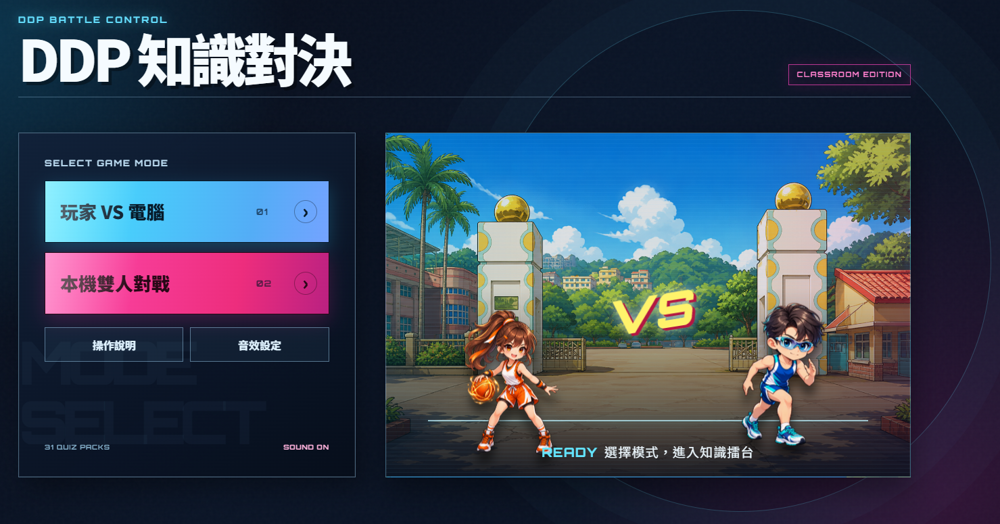
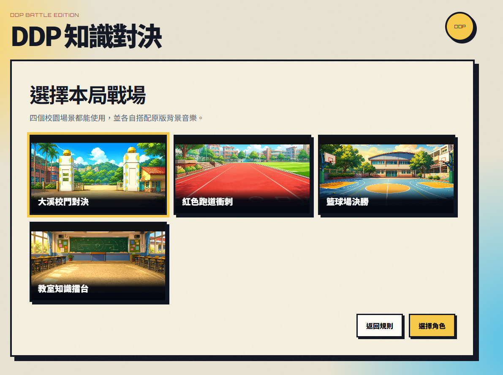
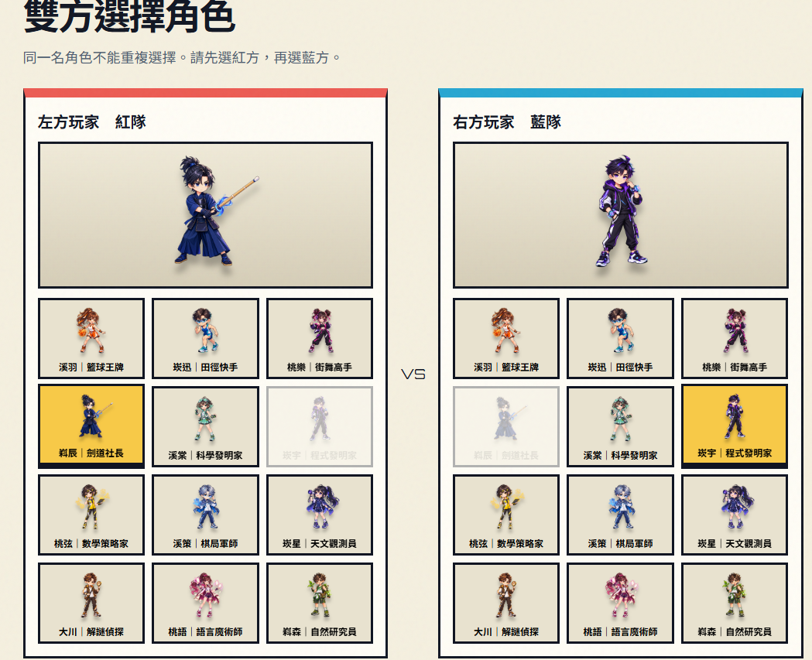

# DDP 知識對決

> 學科知識搶答 × 校園角色對戰。答對就發動攻擊，先以知識與反應取得勝利。

[立即開始遊戲](https://coolokey.github.io/dd2p-quiz-web/)

《DDP 知識對決》是為課堂互動與校園競賽設計的靜態網頁遊戲。玩家可選擇題庫、校園戰場與角色，使用鍵盤、行動載具觸控或 USB 手把即時搶答；答對可得分並使對手扣除生命值，生命值歸零即 KO。

## 遊戲畫面

| 起始畫面：選擇玩家 VS 電腦或本機雙人對戰 | 校園戰場：四個大溪國中風格場景可自由選擇 |
| :---: | :---: |
|  |  |

| 角色選擇：12 位原創校園社團英雄 |
| :---: |
|  |

## 玩法流程

1. 選擇「玩家 VS 電腦」或「本機雙人對戰」。
2. 從 31 份題庫中依科目挑選本局題目。
3. 設定題數或限時模式；單人模式可選擇電腦難度。
4. 選擇校園戰場與角色；開始前可測試鍵盤，或直接略過。
5. 先按下答案鍵者取得作答權。答對可得 1 分、對手扣除 10 HP；答錯則由另一方作答。
6. 任一方 HP 歸零即 KO；題數或時間結束時依分數判定，平手進入驟死賽。

## 校園角色與戰場

### 12 位原創校園英雄

溪羽｜籃球王牌、崁迅｜田徑快手、桃樂｜街舞高手、嵙辰｜劍道社長、溪棠｜科學發明家、崁宇｜程式發明家、桃弦｜數學策略家、溪策｜棋局軍師、崁星｜天文觀測員、大川｜解謎偵探、桃語｜語言魔術師、嵙森｜自然研究員。

每位角色都有獨立的 Q 版造型與氣功、出拳、出腳招式；每次答對會在三類攻擊間隨機且平均輪替，受擊方也會呈現互動動作。

### 四個校園戰場

- 大溪校門對決
- 紅色跑道衝刺
- 籃球場決勝
- 教室知識擂台

選角與選場地使用輕量縮圖，進入對戰才載入高畫質場景與角色，讓新電腦及行動載具的首次操作更順暢。

## 題庫與公平出題

目前提供 31 份 A_QuizBase 轉換題庫，包含數學、國文、英文、歷史與公民；題庫可依科目篩選，支援純文字與圖文題、2 至 4 個選項及注音標註。

題目與選項都會隨機排列。正確答案位置採用「隨機且平均」的位置袋機制：在相同選項數的題目中，各位置會平均出現，避免學生從答案位置猜題。

## 操作方式

| 裝置 | 操作方式 |
| --- | --- |
| 電腦鍵盤 | 紅隊作答使用 `1`、`2`、`3`、`4`；藍隊作答使用 `0`、`-`、`=`、`\\`。開始前可進行鍵盤測試；`Esc` 開啟暫停選單。 |
| 平板／手機 | 對戰時請橫向使用。單人提供一組答案按鈕；本機雙人提供左右兩組觸控按鈕。直向時會暫停並停止作答輸入；選擇返回首頁時會先確認。 |
| USB 手把 | 使用瀏覽器 Gamepad API；支援按鍵測試與邊緣觸發，避免按住按鈕連續作答。不同型號的實體按鍵編號請以遊戲內測試為準。 |

對戰中可使用頂端「Ⅱ 暫停」或鍵盤 `Esc`，選擇繼續、重新開始本局、更換題庫與返回首頁；重新開始本局、更換題庫與返回首頁都需要確認，避免誤觸中斷。

## 本機開發

需求： Node.js 22 或更新版本。

```powershell
# 轉換 A_QuizBase 題庫為網頁 JSON
npm run convert

# 執行自動化測試
npm test

# 啟動本機伺服器
npm start
```

如需重新準備舊版對戰素材，可執行：

```powershell
npm run prepare:battle
```

## 部署與隱私

推送至 `main` 分支後，GitHub Actions 會自動測試並部署 `web` 目錄至 GitHub Pages。

本遊戲為純前端靜態網站，不要求登入、不含廣告，也不儲存學生姓名、帳號或個人資料。

## 專案連結

- [GitHub Repository](https://github.com/coolokey/dd2p-quiz-web)
- [線上遊玩網址](https://coolokey.github.io/dd2p-quiz-web/)
